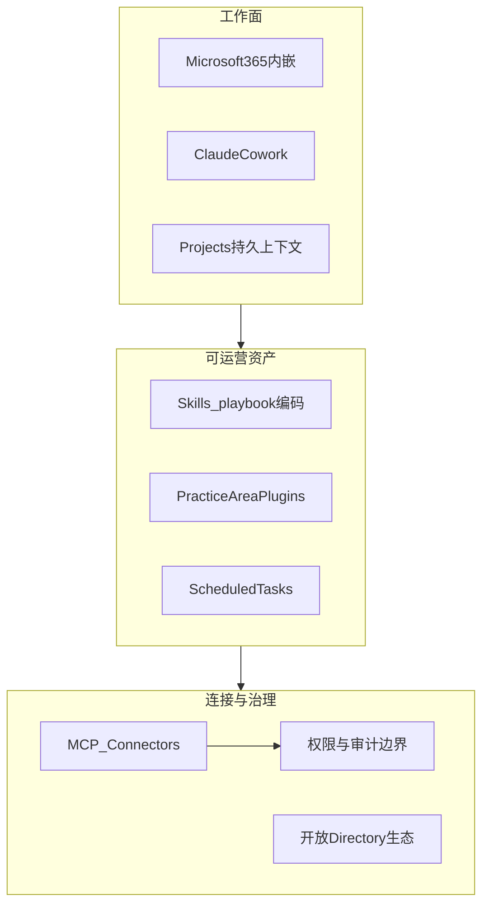

# Claude for the legal industry — 深度分析

- **来源**：https://claude.com/blog/claude-for-the-legal-industry
- **发布日期**：2026-05-12
- **厂商**：Anthropic
- **类型**：行业方案 + 产品发布（MCP 连接器 + 法务插件生态）
- **相关产品**：Claude Cowork、Claude for Word/Outlook/Excel/PowerPoint、Projects、Opus 4.7、Legal Marketplace

---

## 一句话结论

Anthropic 把法务场景打成 **「Office 内嵌 + MCP 接全栈法务系统 + 12 个 practice-area 插件 + 开放生态」** 的标准打法；竞争焦点已从模型能力转向 **可信、权限边界、playbook 级 Skills、可运营 Agent 资产**——对顺丰/ToB 进化 POC 的参考价值在于「连接器 + 领域插件 + 治理」三件套，而非单纯 memory/skill 算法。

---

## 发布了什么（事实摘要）

### 1. 产品形态：法务工作在哪里发生，Claude 就跟到哪里

- **Microsoft 365 四件套内嵌**（Word / Outlook / Excel / PowerPoint），跨应用携带上下文（例如 Word 红线 → Outlook 附函 → Excel 交割清单 → PPT 董事会摘要）。
- **Claude Cowork**：跨多文档的批量任务（合同分拣、产品上线法务评审、监管动态董事会备忘）。
- **Projects**：按 matter 持久化先例与历史草稿。
- **Scheduled tasks**：周期性任务（监管周报、intake 分拣）。

### 2. 20+ MCP 连接器：按法务技术栈分层

| 类别 | 代表连接器 | 能力要点 |
|------|------------|----------|
| 合同生命周期 | Definely, Docusign, Ironclad | 结构解析、条款检索、权限内问答、全生命周期编排 |
| 交易/数据室 | Box, Datasite | VDR 检索、文件夹/Q&A/就绪度审计 |
| 文档管理 | iManage, NetDocuments | 权限绑定、可审计访问、先例起草 |
| 专家网络/技能库 | Lawve AI, The L Suite | 律师编写的 skill 库、外聘律师匹配 |
| 电子取证 | Consilio, Everlaw, Relativity | 项目内检索、matter 搭建、权限治理 |
| 可信工作流 | Thomson Reuters CoCounsel | 权威法源 + KeyCite + 可验证输出 |
| 法律研究 | Legal Data Hunter, Midpage, Trellis | 多法域语料、州法院数据分析 |
| 法律 AI 互连 | Harvey, Solve Intelligence | 双向集成（Harvey Vault、专利 prior art） |
| 公益/自助 | BoardWise, Courtroom5, Descrybe, Free Law Project | 低门槛法律援助、判例检索 |

### 3. 12 个 practice-area 插件（Legal Marketplace）

每个插件启动时有 **setup interview**，采集 playbook、升级链、风险偏好、文风，使输出非泛化。

覆盖：Commercial / Corporate / Employment / Privacy / Product / Regulatory / AI Governance / IP / Litigation / Law Student / Legal Clinic / Legal Builder Hub。

部分插件提供 **cookbook → Managed Agents**（Commercial、Corporate、Litigation、Product 等），可程序化部署到 Claude Platform。

### 4. 开放生态与双向集成

- 插件与 skill 基于 **开放协议**；Box、Legal Quants、Lawve、Thomson Reuters 等已贡献。
- **CoCounsel 基于 Claude Agent SDK 重建**；本次发布实现 **双向** MCP 集成（Harvey、Solve Intelligence 等同理）。
- 强调 **Opus 4.7** 在长文档法务推理上的能力；合作伙伴引用 BigLaw Bench、引用忠实度等垂直指标。

### 5. 公益与定价

- 与 Free Law Project、Justice Technology Association 等合作；非营利法务机构可走 Claude for Nonprofits 折扣。

---

## 架构与机制拆解（对理解「进化」很重要）

### A. 三层堆栈（Anthropic 的法务 Agent 公式）

1. **连接器层（MCP）**：把「matter 级」真实数据（合同、取证、DMS、研究库）接进 Agent，且强调 **scoped to user permissions**。
2. **资产层（Skills + Plugins）**：把律所/企业 **playbook、升级链、文风** 编码为可复用指令；插件 = 角色化任务包 + 启动访谈个性化。
3. **工作面层（Office + Cowork + Projects）**：保证高频动作在现有工具链完成，降低 adoption 摩擦。

### B. 「进化」在这篇文章里怎么体现？

文章**没有**宣传 Hermes 式 autonomous self-evolution，而是强调：

| 机制 | 含义 | 是否「自动进化」 |
|------|------|------------------|
| Skills = team playbooks | 人工/机构沉淀的标准，Agent 执行时引用 | 人工定义资产，非自动改写 |
| Plugin setup interview | 每次部署时校准团队规则 | 配置型个性化 |
| Legal Builder Hub | 社区 skill 安装前 **安全/许可/新鲜度审查** | 治理型「进化」，非黑盒自改 |
| 合作伙伴「self-improving systems」 | Legora 等厂商侧工程化迭代 | 生态方负责，非 Claude 内核自动进化 |
| Opus 4.7 + 垂直评测 | 模型代际升级 | 模型发布节奏，非环境驱动进化 |

**结论**：Anthropic 法务路线的「进化」= **可迭代、可审计、可扩展的 Agent 资产体系**（skill/plugin/connector），加上 **模型版本升级**；企业关心的仍是 **人审、权限、可追溯**，与你们讨论的 ToB 治理分级一致。

### C. 与 Harvey / Thomson Reuters 的关系

- **竞合共存**：Harvey connector 进 Claude；CoCounsel 基于 Claude SDK 又反向接入 Claude。
- 平台策略：**Claude 做编排与工作面 + 垂直厂商做权威内容与垂直工作流**，通过 MCP 互操作而非一家通吃。

---

## 核心实现拆解（剧透式）

> 法务方案在工程上 **几乎无业务后端**：开源仓 [claude-for-legal](https://github.com/anthropics/claude-for-legal) 主体是 **可安装配置包**（JSON + Markdown + MCP URL）。下文为 4 个核心模块摘要；逐步代码与 sequence 图见 **[实现拆解全文](./2026-05-12_claude-for-legal-industry_实现拆解.md)**。

### 核心模块

| 模块 | 职责 | 实现形态 |
|------|------|----------|
| **Marketplace 清单** | 列出可安装领域插件 | `.claude-plugin/marketplace.json` → `{name, source: "./commercial-legal"}` |
| **领域插件目录** | 单 practice area 的全部资产 | `plugin.json` + `.mcp.json` + `skills/` + `agents/` + `hooks/hooks.json` |
| **Skill（SKILL.md）** | 可执行 SOP | YAML frontmatter + Markdown 步骤；**无** `if/else` 业务代码，分支由 LLM 读文执行 |
| **用户 config CLAUDE.md** | 团队 playbook 落地 | `cold-start-interview` skill **写入** `~/.claude/plugins/config/.../CLAUDE.md`；其他 skill 执行前 **Read** 该文件 |

### 主路径（剧透）

1. 用户从 Legal Marketplace 安装 → Claude Code **扫描** `plugin.json` / skills / `.mcp.json` → **拉起** Ironclad、DocuSign 等 HTTP MCP。
2. 用户 `/nda-review` + 合同 → 路由加载 `nda-review/SKILL.md` → 模型按正文「先读 config 里 NDA playbook」→ `mcp__ironclad__*` 查条款 → 输出 GREEN/YELLOW/RED。
3. **Managed Agents**（`managed-agent-cookbooks/*.yaml`）把同一套 `agents/*.md` 用 YAML 包一层，供 **Claude Platform API** 部署定时任务（如 renewal-watcher），与 Cowork 交互插件是 **同一套 Markdown 资产、两种运行时**。

### 与「表面叙事」的差异

| 对外话术 | 代码层现实 |
|----------|------------|
| 「12 个法务 AI 产品」 | 12 个 **目录插件** + prompt/SOP，不是 12 个微服务 |
| 「MCP 连接器集成」 | 插件内 **只声明 MCP URL**；Ironclad API 在厂商侧 |
| 「Setup interview 个性化模型」 | **写用户本机 Markdown 配置**，不是 fine-tune |

---

## 对 ToB Agent 的启示（含物流/顺丰类场景）

1. **行业落地 = 连接器地图 + 角色化插件，不是通用 Chat**  
   法务按 CLM/DMS/eDiscovery 切；物流应对 WMS/TMS/OMS/工单/客服系统切——进化 POC 应先画 **系统连接器清单**，再谈 skill/mem。

2. **Playbook 优先于 prompt 调优**  
   Word 里的 Skills（红线、fallback clause、格式检查）= 把 SOP 变成可执行资产；顺丰高频任务应先 **显性化 playbook**，再决定写 skill 还是 memory。

3. **Setup interview = 轻量「进化前置」**  
   插件启动访谈本质是 **把组织规则注入 Agent**；ToB 可做成每次 matter/客户/仓区的配置 profile，而不是指望黑盒自学习。

4. **治理即产品**  
   Legal Builder Hub 的安装审查 ≈ 你们说的 P0/P1 变更审批；**进化系统必须带 notify + approve + rollback**。

5. **采购话术变化**  
   客户买的是「接进现有栈 + 可运营模板 + 可信输出」，不是「更聪明的模型」；FDE 材料应对齐 **完成率、人工接管率、审计、权限**。

6. **Scheduled tasks = 进化效果的稳定出口**  
   监管周报、intake 分拣等 recurring work 适合作为 POC 第一批 **可度量闭环**。

---

## 与当前工作的关联

| 本项目/文档 | 关联点 |
|-------------|--------|
| `projects/sf_claw_evolution_poc` | 顺丰应先做 **现状 workflow + 系统连接器盘点**（对标本文 MCP 地图），再定 skill/mem 进化范围 |
| `framework/evolution_onepager.md` | Anthropic 侧更重 **skill/playbook 资产化**；memory 体现在 Projects/matter 上下文，而非强调 autonomous mem 进化 |
| `research/tech_selection_for_sf_poc.md` | A 路线可对齐「插件+skill」；B 路线对齐权限/审计/回滚；C 路线对齐 Word 式 reflection/校验 |
| `insights/tob_agent_research_2026` | 印证「系统竞赛」：Office + MCP + Managed Agents |

---

## 待跟踪信号

- [ ] Legal Marketplace 上社区 skill 的实际安装量与审查标准是否公开
- [ ] Managed Agents cookbook 与 Cowork 插件的能力差异（API 可编程边界）
- [ ] CoCounsel ↔ Claude **双向** MCP 的权限与计费模型
- [ ] Opus 4.7 在长文档任务上的官方 benchmark 与第三方（Harvey BigLaw Bench）是否一致
- [ ] 非法务行业是否复制同一模板（金融已有 finance agents，物流是否跟进）

---

## 延伸阅读

- **代码层实现拆解**（插件目录、Skill/Agent/MCP、执行链路）：[2026-05-12_claude-for-legal-industry_实现拆解.md](./2026-05-12_claude-for-legal-industry_实现拆解.md)

## 参考链接

- 原文：https://claude.com/blog/claude-for-the-legal-industry
- Legal 插件仓库：https://github.com/anthropics/claude-for-legal
- Connectors Directory：https://claude.ai/directory/connectors
- Enterprise Agents Briefing（CoCounsel on SDK）：https://www.anthropic.com/events/the-briefing-enterprise-agents-virtual-event
