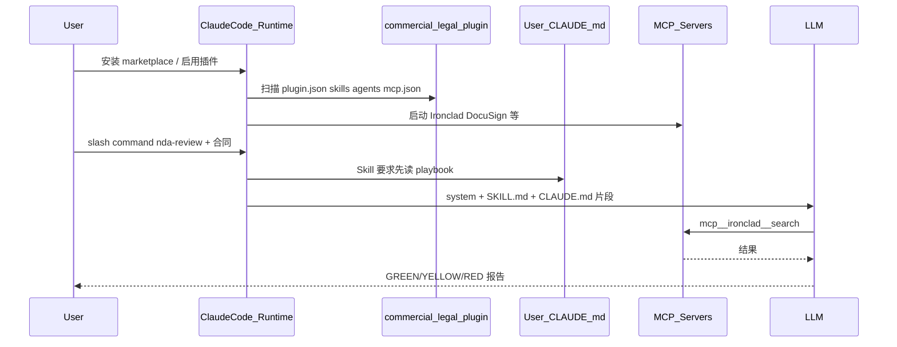

# Claude 法务领域插件 — 代码层实现拆解

- **关联战略分析**：[2026-05-12_claude-for-legal-industry.md](./2026-05-12_claude-for-legal-industry.md)
- **开源仓库**：https://github.com/anthropics/claude-for-legal
- **官方博客**：https://claude.com/blog/claude-for-the-legal-industry

---

## 一句话结论

领域插件在代码层**几乎不是业务后端**，而是 **可加载的配置包**：JSON 清单 + Markdown 里的 prompt/SOP（Skills、Agents）+ MCP 声明 + 用户本机实践配置。运行时由 Claude Code / Cowork 扫描加载，再交给 LLM + MCP 工具执行。

仓库自述：*「Most work here is editing prompt content (skills, agents, hooks), plugin metadata, or cookbook config — not application code.»*

---

## 1. 仓库级结构

```
claude-for-legal/
├── .claude-plugin/marketplace.json   # 应用商店清单：列出所有插件
├── commercial-legal/                 # 一个「领域插件」= 一个目录
├── litigation-legal/
├── privacy-legal/
├── managed-agent-cookbooks/          # 可 API 部署的版本（YAML）
└── external_plugins/cocounsel-legal/ # 厂商维护的插件
```

`marketplace.json` 示例：

```json
{
  "name": "commercial-legal",
  "source": "./commercial-legal",
  "description": "Reviews vendor agreements, NDAs..."
}
```

用户从 Legal Marketplace 安装时：把 `commercial-legal/` 目录装进 Claude，并在运行时注册。

---

## 2. 单个领域插件目录（以 commercial-legal 为例）

```
commercial-legal/
├── .claude-plugin/plugin.json    # 插件元数据
├── .mcp.json                     # MCP 服务声明
├── CLAUDE.md                     # 实践配置「模板」（安装后不自动当 project context）
├── skills/
│   ├── cold-start-interview/SKILL.md
│   ├── nda-review/SKILL.md
│   └── ...
├── agents/
│   ├── renewal-watcher.md
│   └── ...
└── hooks/hooks.json
```

### 2.1 plugin.json — 注册名片

```json
{
  "name": "commercial-legal",
  "version": "1.0.2",
  "description": "Reviews vendor agreements, NDAs..."
}
```

### 2.2 .mcp.json — 连接器声明

```json
{
  "mcpServers": {
    "Ironclad": {
      "type": "http",
      "url": "https://mcp.na1.ironcladapp.com/mcp"
    },
    "DocuSign": {
      "type": "http",
      "url": "https://mcp.docusign.com/mcp"
    }
  }
}
```

此处**不实现** Ironclad API，只声明启用插件时要拉起的 MCP HTTP 端点，模型才能使用 `mcp__ironclad__*` 类工具。

---

## 3. Skill：最小执行单元（Markdown + YAML）

路径：`skills/<name>/SKILL.md`

```markdown
---
name: nda-review
description: >
  Fast triage of inbound NDAs into GREEN / YELLOW / RED...
user-invocable: false
---

# NDA Review

## Load the playbook first
Before triaging, read
`~/.claude/plugins/config/claude-for-legal/commercial-legal/CLAUDE.md`
→ `## Playbook` → `NDA triage positions`...
```

**运行时：**

1. Claude Code 扫描 `skills/*/SKILL.md`，将 `description` 纳入可选 skill 列表
2. 用户输入或路由匹配时，将 SKILL 正文注入上下文
3. 模型按 Markdown 步骤执行（读配置、调 MCP、输出）

**Skill 的「代码」= 结构化 prompt + 操作步骤**，不是传统函数。

---

## 4. Setup interview：个性化写入用户本机

`skills/cold-start-interview/SKILL.md` 会：

1. 访谈用户（playbook、升级链、风险偏好…）
2. 读取合同样本
3. **写入** `~/.claude/plugins/config/claude-for-legal/commercial-legal/CLAUDE.md`

其他 skill（如 `nda-review`）执行前强制读取该文件。

| 层 | 位置 | 作用 |
|----|------|------|
| 通用领域逻辑 | 仓库内 `skills/*.md` | 流程、检查项、输出格式 |
| 团队个性化 | 用户机 `config/.../CLAUDE.md` | playbook、升级矩阵、文风 |
| Matter 级（可选） | `config/.../matters/<id>/` | 单案件上下文 |

**个性化不是改数据库，而是改用户目录下的 Markdown 配置。**

> 注意：插件根目录的 `CLAUDE.md` 是**模板**，由 cold-start 复制到 config 路径；安装时不会自动当 project context 加载（`claude plugin validate` 会提示，属预期行为）。

---

## 5. Agent：子代理定义（仍是 Markdown）

`agents/renewal-watcher.md`：

```markdown
---
name: renewal-watcher
description: Scheduled agent that checks the renewal register...
model: sonnet
tools: ["Read", "Write", "mcp__ironclad__*", "mcp__*__slack_send_message"]
---

# Renewal Watcher Agent
1. Read CLAUDE.md to get alert destination
2. Load renewal-tracker skill, run Mode 2...
3. Post report to Slack
```

运行时：Claude Code 将该 md 作为**子 Agent 的系统提示 + 工具白名单**，可配合 Scheduled tasks 定时触发。

---

## 6. 一次请求的执行链路



分支逻辑写在 SKILL 正文里，由模型按说明执行，**没有**自研的 `if (clause.type == "NDA")` 业务代码。

---

## 7. Managed Agents：YAML 面向 API 部署

`managed-agent-cookbooks/renewal-watcher/agent.yaml`：

```yaml
name: renewal-watcher
model: claude-opus-4-7
system:
  file: ../../commercial-legal/agents/renewal-watcher.md
tools:
  - type: agent_toolset_20260401
    configs:
      - { name: read, enabled: true }
mcp_servers:
  - { type: url, name: ironclad, url: "${IRONCLAD_MCP_URL}" }
skills:
  - { from_plugin: ../../commercial-legal }
callable_agents:
  - { manifest: ./subagents/repo-reader.yaml }
```

同一套 `renewal-watcher.md`，外包 YAML 定义工具范围、子 Agent、环境变量 —— **Cowork 交互插件** 与 **Claude Platform 可编程 Agent** 的第二种打包。

Cookbook 约束（仓库 lint）：

- Orchestrator 仅本地工具（read/grep/glob）；MCP 与 Write 放在 subagent leaves
- README 安全表与 `agent.yaml` 授权必须一致

---

## 8. 与「进化」的边界

| 机制 | 是否代码内 self-evolve |
|------|------------------------|
| 新 skill 写入仓库 | 人工发版，git 管理 |
| cold-start 写 CLAUDE.md | 访谈生成配置 |
| skill 发现 playbook 缺项，写回 CLAUDE.md | 交互式沉淀，半自动 |
| renewal-watcher 定时跑 | 调度 + prompt |
| Hermes 式 GEPA 优化 | **不在** 此仓库 |

**领域插件 = 声明式组件 + Prompt 资产 + 用户配置 + MCP。**  
企业级「进化」若要做，需在**变更治理层**（notify / approve / rollback）上叠加，不是插件目录开箱即有。

---

## 9. 仿造领域插件的最小技术清单（ToB / 物流场景）

1. Plugin manifest（name、version、description）
2. `skills/<task>/SKILL.md`：每个高频任务一份 SOP prompt
3. `agents/*.md`：定时/多步任务，声明 `model` + `tools`
4. `.mcp.json`：WMS/TMS/工单等 MCP URL
5. `config/<tenant>/PLAYBOOK.md`：对标 `CLAUDE.md`，访谈或导入生成
6. （可选）`agent.yaml`：API / Managed Agent 部署
7. 运行时：扫描加载 + 权限 + 审计 + **变更 notify/approve/rollback**

---

## 10. 概念对照表

| 概念 | 实现形态 |
|------|----------|
| 领域插件 | 一个目录 + `plugin.json` + marketplace 注册 |
| 领域 Skill | `skills/*/SKILL.md` |
| 子 Agent | `agents/*.md` + frontmatter |
| 系统连接 | `.mcp.json` → HTTP MCP |
| 团队 playbook | 用户机 `~/.claude/plugins/config/.../CLAUDE.md` |
| 可编程部署 | `managed-agent-cookbooks/*/agent.yaml` |

---

## 参考

- 仓库 CLAUDE.md（维护者指南）：https://github.com/anthropics/claude-for-legal/blob/main/CLAUDE.md
- Claude Code 插件结构 SKILL：https://github.com/anthropics/claude-plugins-official/blob/main/plugins/plugin-dev/skills/plugin-structure/SKILL.md
- 插件开发文档：https://code.claude.com/docs/en/plugins
