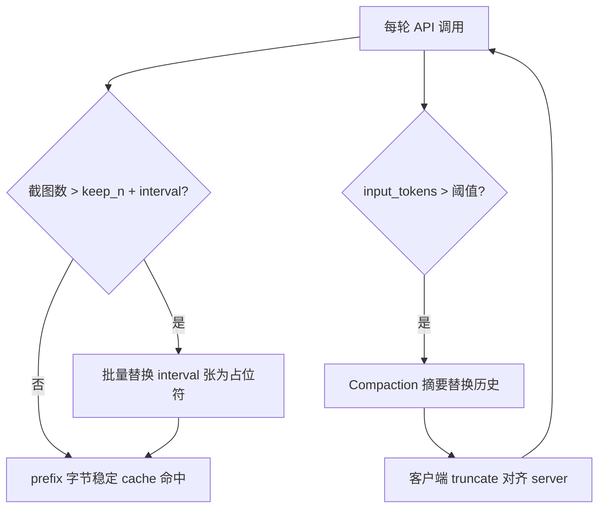

# Best practices for computer and browser use with Claude — 深度分析

- **来源**：https://claude.com/blog/best-practices-for-computer-and-browser-use-with-claude
- **发布日期**：2026-05-13
- **厂商**：Anthropic
- **类型**：技术博客（Computer Use / Browser Use 集成最佳实践）
- **相关产品**：Claude 4.6 家族（Opus/Sonnet/Haiku 4.5/4.6）、Opus 4.7、Computer Use API（`computer_20251124`）、Advisor tool、Server-side compaction、Teach Mode 演示回放

---

## 一句话结论

Anthropic 把 Computer/Browser Use 的生产可靠性归结为 **Harness 工程**：发送前主动 downscale 截图并对齐坐标系，比换模型更重要；长会话靠 **cache-aware 批量 prune + compaction** 控成本；安全默认靠官方 tool 的 prompt injection 分类器，但 **人机确认与最小权限** 仍不可省——对 ToB/进化 POC 的启示是「感知-执行一致性 + 可审计轨迹 + 演示资产化」，而非堆 thinking token。

---

## 发布了什么（事实摘要）

### 1. 定位与配套

- 面向在 Claude API 上集成 **Computer Use / Browser Use** 的开发者。
- 适用 **Claude 4.6 家族** 与 **Opus 4.7**（分辨率上限、thinking 建议有分叉）。
- 发布配套 demo：[computer-use-best-practices](https://github.com/anthropics/claude-quickstarts/tree/main/computer-use-best-practices)（含 trajectory viewer、tool debug panel、localization playground）。

### 2. 点击准确率：分辨率与坐标（最高 ROI）

| 约束 | Claude 4.6 家族 | Opus 4.7 |
|------|-----------------|----------|
| 长边上限 | 1568 px | 2576 px |
| 总像素上限 | 1.15 MP | 3.75 MP |
| 超限行为 | API **静默 downscale** | 同上 |
| 推荐默认分辨率 | **1280×720** | **1080p** 起步 |

核心机制：模型在 **被 downscale 后的图像** 上预测坐标，但 harness 若仍按原生分辨率声明 `display_width_px` / `display_height_px`，则 **「模型所见」与「声明坐标系」不一致** → 点击系统性偏移。

必做三件事：

1. **发送前主动 downscale**（勿发原生 4K / 超限 1080p）。
2. **`display_*` = 实际发送图片尺寸**（非物理屏幕分辨率）。
3. 执行点击前将 API 坐标 **按比例映射回真实屏幕**。

消息顺序：**text 指令在 image 之前**。

模型选择（点击）：

- 4.6：**Sonnet 4.6** 空间精度更好；重度 downscale 时比 Opus 4.6 更稳。
- **Opus 4.7** 点击精度接近 Sonnet，像素预算更高、少压缩。
- 高吞吐：**Haiku 4.5**；复杂任务可用「规划模型 + Sonnet/Haiku 执行点击」。

小目标：官方 tool 配置 **`enable_zoom: True`**；放大 UI；键盘替代极小的点击目标；macOS Retina 注意 **device pixel ratio 2×** 错位。

**实测无效**：分块 tile、坐标网格 overlay、不同 resize 算法（LANCZOS vs sips 无差别）。

### 3. Adaptive Thinking（effort）

UI 自动化以感知+机械操作为主，过多 thinking 收益递减。

| 模型 | 默认 effort | 备注 |
|------|-------------|------|
| 4.6 | `medium` | 性价比最高；有重试时 medium≈high 最终成功率 |
| 4.6 | 禁用 thinking | 极短、固定、低延迟流程 |
| 4.6 | 不推荐 `max` | 相对 `high` 无收益、更贵 |
| Opus 4.7 | `high` | OSWorld 上接近最优 |
| Opus 4.7 | `max` | 仅一次性极难任务 |

### 4. 安全：Prompt Injection

- 官方 `computer_20251124`：**内置分类器默认开启**，近零额外延迟与费用。
- 自定义 screenshot/click tool：**不跑**内置分类器（需填 interest form）。
- 防御三层：训练时鲁棒性、实时分类器、持续红队。
- 工程侧仍须：**人机确认**（提交/付款/发消息）、**最小权限**、**全链路日志**、system prompt 区分用户指令与页面内容。

### 5. 上下文管理（长会话）

- 每张截图约 **1000–1800 tokens**；200k 窗口可能 **<100 步**满。
- 推荐三层组合：
  1. **Prompt caching**：稳定前缀 1 个 breakpoint + 最近 3 个 `tool_result` ephemeral（共 4 个上限）。
  2. **Cache-aware rolling buffer**：`keep_n=3`，每 `interval=25` 张**批量**将旧图替换为 `[Image omitted]`（避免每步改 prefix 打爆 cache）。
  3. **LLM compaction**：自定义 `COMPACT_PROMPT`（必须保留用户原文指令、进度、错误修复）；可用服务端 `compact_20260112` beta；**客户端 mirror 截断**与 server 对齐。

### 6. 实验性能力（非 blanket 推荐）

| 能力 | 适用 | 风险 |
|------|------|------|
| `computer_batch` / `browser_batch` | 互不依赖视觉状态的连续操作 | 中间失败基于陈旧状态继续 |
| **Advisor tool** | 长任务偶发需 Opus 级规划 | 按次 Opus 计费；停用 tool 须 strip orphaned advisor blocks |
| **Reminder nudges** | 提醒用 batch/advisor | 少量 token，可能扰动 cache |
| **Teach Mode / 演示回放** | 录屏+标注+步骤作 context | 非严格 replay；长 workflow 需先 compact |

### 7. 失败诊断

- 非点击问题：系统级下拉、浏览器外 UI → 改用 JS、键盘、DOM。
- 调试：overlay 预测点击、localization playground、trajectory viewer。

---

## 架构与机制拆解

### A. Harness 数据流（点击准确性的核心）


**静默 downscale 陷阱**：若 harness 跳过 prep，API 内部缩小图像，模型坐标仍落在 harness 声明的 display 空间 → 偏移。这是文内强调的 **单一最高 ROI 优化**。

**`compute_max_api_fit`**：按原生宽高比在 long edge / total pixels 约束下最大化 fidelity，避免强行 16:9 扭曲；相对固定 720p 提升 modest。

### B. 长会话：Cache + Prune + Compact



- **Naive rolling buffer**（每张图到期即删）：每轮改 prefix → cache 持续失效。
- **批量 prune**：在 `interval` 轮内 prefix 不变 → cache 可命中。
- **Compaction**：保留任务语义；触发即 cache 失效，应 **低频**。

`COMPACT_PROMPT` 关键段落：User Instructions（verbatim）、Task Template、Constraints、Actions、Errors & Fixes、Progress、Current State、Next Step。

### C. Thinking 与任务类型匹配

| 任务性质 | thinking 价值 |
|----------|----------------|
| 识别元素 + 点击 | 低（perceptual/mechanical） |
| 多步规划再执行 | 中–高 |
| 意外 UI 恢复 | 中–高 |
| 专业软件复杂项目 | 高 |

故 4.6 默认 `medium`、Opus 4.7 默认 `high`，而非无脑 `max`。

### D. Teach Mode：Show, don't tell


- `WorkflowStep`：action、description、selector、coordinates、screenshot、viewport、可选 speech。
- 回放 **非严格坐标 replay**：Claude 根据当前 UI 找等价元素。
- 严格度：Strict / Adaptive（默认）/ Goal-oriented（先摘要再执行）。

### E. 与「进化」概念的对照

| 机制 | 含义 | 是否 autonomous 进化 |
|------|------|----------------------|
| Harness 调参（分辨率/cache/prune） | 工程侧可靠性 | 配置迭代，非模型自改 |
| Compaction 摘要 | 长会话记忆压缩 | 有损压缩，需保留用户指令 |
| Teach Mode 录制 | 人工演示 → 可复用 workflow 资产 | 人工沉淀，非黑盒自学习 |
| Advisor | 执行中咨询更强模型 | 单次规划辅助 |
| 官方 PI 分类器 | 安全层 | 平台能力升级 |

**结论**：此文路线是 **可观测、可调试、可运营的 Agent harness + 演示资产**，与法务文里的 skill/plugin 资产化同属 ToB 可治理范式。

---

## 核心实现拆解（剧透式）

> 参考实现：[computer-use-best-practices](https://github.com/anthropics/claude-quickstarts/tree/main/computer-use-best-practices)（Python harness，**非** Anthropic 闭源服务端；博客最佳实践在此落地为可读的 `loop.py` + `tools/`）。

### 核心模块

| 模块 | 职责 | 关键接口/产物 |
|------|------|----------------|
| `image.py` | 发送前 resize，保证模型所见像素 = 声明坐标系 | `target_image_size()` 二分搜最大合法 (w,h)；`resize_and_encode()` → JPEG base64 + `(sent_w, sent_h)` |
| `tools/computer.py` | 截图、点击、缩放坐标、Retina 修正 | `_scale_to_screen()`；`to_hosted_param()` 填 `display_width_px/height_px` |
| `formatters.py` + `loop.py` | cache-aware 截图 prune、API 调用、compaction 对齐 | `image_prune_strategy="interval"`；`cache_control` on system + 最近 tool_result |
| `tools/*.py`（显式 schema） | 模型看到的 tool 定义在客户端，执行也在客户端 | 默认**非** hosted `computer_20251124` → **无**官方 PI 分类器，靠 VM 隔离 |

### 主路径：一轮「截图 → 点击」

1. **`ComputerTool.__init__`**：用 `pyautogui.size()` 得逻辑屏 `screen_w×screen_h`，预计算 `sent_w×sent_h = target_image_size(...)`（与 hosted tool 的 `display_*` 一致）。
2. **模型调 `screenshot`**：`take_screenshot()` → Retina 时先把物理像素图 resize 到逻辑分辨率 → `resize_and_encode()` → tool_result 带 `base64_image` + meta `sent_size` / `screen_size`。
3. **模型返回坐标 (x,y)**（**sent 图像空间**）：`left_click` 等走 `_scale_to_screen`：`screen_x = round(x * screen_w / sent_w)`。
4. **`loop.py` 下一轮请求前**：`formatters` 按 interval 策略把最老一批截图换成占位文本（前缀多轮字节相同以命中 prompt cache）；若 `enable_autocompaction` 且 token 超阈，服务端 compact 后客户端 truncate 本地 `messages` 与 server 对齐。

```mermaid
sequenceDiagram
  participant Loop as loop.py
  participant Img as image.py
  participant API as Anthropic_API
  participant Comp as ComputerTool

  Loop->>Comp: screenshot
  Comp->>Img: resize_and_encode
  Img-->>Comp: b64, sent_w x sent_h
  Comp-->>Loop: tool_result image
  Loop->>API: messages + tools(display=sent)
  API-->>Loop: tool_use click (x,y in sent space)
  Loop->>Comp: execute coordinate
  Comp->>Comp: _scale_to_screen
  Note over Comp: pyautogui.click on logical pixels
```

### 与「表面叙事」的差异

| 博客/文档说法 | 参考实现里实际做法 |
|---------------|-------------------|
| 博客示例用 PNG + `prepare_screenshot(1280,720)` | Demo 默认 **JPEG** + API 同款 **28×28 tile 预算** 的 `target_image_size`（注释写明 port API reference algorithm，避免静默二次缩放） |
| 官方 `computer_20251124` 自带 PI 分类器 | Demo 默认 **显式 tool schema**（`computer_use/tools/computer.py`），分类器仅在 `use_hosted_computer_tool=True` 时通过改 **声明** 开启，执行仍本地 |
| 博客 `keep_n=3, interval=25` | Demo 默认 `image_prune_min=3`, **`image_prune_interval=40`**（README 解释：在触发 autocompaction 前先靠 prune 控图） |

Teach Mode / `computer_batch` 在本 repo 中分别为 **博客伪代码模式** 与 `tools/batch.py` 自定义 tool，逻辑与主 loop 相同：仍是「显式 tool → 本地 execute → 截图回灌 messages」。

---

## 对 ToB Agent 的启示

1. **生产 Agent 的第一性原理是「感知-执行一致」**  
   任何基于截图/坐标的集成（含自建 Playwright、RPA、桌面自动化）都应显式实现：**downscale → display 声明 → scale 回物理坐标**；否则模型升级也无法救偏移。

2. **成本与延迟的主杠杆是上下文工程，不是更大模型**  
   截图 token 线性累积；cache-aware 批量 prune + 低频 compaction 对长 horizon POC（客服多轮、工单流转）比换 Opus 更划算。

3. **Thinking effort 按任务分型采购**  
   固定 UI 流程可 4.6 + low/禁用 thinking；探索性导航用 medium/high；避免 UI 任务默认 `max`。

4. **安全 = 分类器 + 权限边界 + 人机闸门**  
   自定义 tool 集成方需自建或等待 PI 分类器；**提交/转账/删数据** 必须 human-in-the-loop，与进化 POC 的 P0/P1 审批一致。

5. **可靠性资产：演示录制 > prompt 迭代**  
   Teach Mode 模式适合顺丰类 **高频、步骤固定、偶发 UI 漂移** 的流程（填单、状态查询）；可先录 SOP，再 adaptive 回放，对标 playbook/skill 资产化。

6. **Batch 与 Advisor 是吞吐/推理的 trade-off 旋钮**  
   Batch 降 round-trip，仅用于无视觉依赖链；Advisor 在「多数机械 + 少数规划」长任务中替代全 Opus 循环。

7. **采购与验收指标应对齐 harness 指标**  
   点击命中率、坐标偏移分布、cache 命中率、每任务 input tokens、人工接管率——而非仅端到端「能不能完成一次 demo」。

---

## 与当前工作的关联

| 本项目/文档 | 关联点 |
|-------------|--------|
| `projects/sf_claw_evolution_poc` | 若 POC 含 **浏览器/桌面自动化**，应单独做 harness checklist（分辨率、坐标、消息顺序）；进化 mem/skill 之前先保证 **感知层不错位** |
| `framework/evolution_onepager.md` | 此文「进化」= harness + 演示/workflow 资产 + 模型代际；**非** autonomous 改写 mem |
| `research/tech_selection_for_sf_poc.md` | Computer Use API vs 自建 Playwright/MCP browser：前者坐标 harness 要求硬；后者可用 DOM/ref，但长会话仍要 prune/compaction |
| `insights/tob_agent_research_2026` | 印证 Agent 竞赛进入 **integration reliability + cost engineering** 阶段 |
| Cursor `cursor-ide-browser` MCP | 借鉴「每步 fresh snapshot、text 先于行动、高 stakes 停手」；坐标类原则映射为 **ref 与 viewport 一致性** |

---

## 待跟踪信号

- [ ] `computer-use-best-practices` quickstart 与官方 doc 的版本差（tool type、beta 名）
- [ ] 自定义 tool 的 **PI 分类器** 开放时间表与计费
- [ ] Opus 4.7 在 OSWorld 与真实企业 UI（legacy Win32、Citrix）上的外推有效性
- [ ] Server-side compaction `pause_after_compaction` 与 rolling buffer 同时开启时的 cache 行为
- [ ] Teach Mode 是否产品化为 API 一等能力，或仅 Chrome/Cowork 侧
- [ ] Batch tools 在官方 API 中的标准化程度（目前为 reference impl 自定义 tool）

---

## 参考链接

- 原文：https://claude.com/blog/best-practices-for-computer-and-browser-use-with-claude
- Demo 实现：https://github.com/anthropics/claude-quickstarts/tree/main/computer-use-best-practices
- Computer Use 文档：https://platform.claude.com/docs/en/agents-and-tools/tool-use/computer-use-tool
- Adaptive thinking：https://platform.claude.com/docs/en/build-with-claude/adaptive-thinking
- Prompt injection 研究：https://www.anthropic.com/research/prompt-injection-defenses
- Context engineering：https://www.anthropic.com/engineering/effective-context-engineering-for-ai-agents
- PI 分类器 interest form（自定义 tool）：https://docs.google.com/forms/d/e/1FAIpQLSfXj6rXC-SUQEYHCLabwUe5JuYiYyJ29Ja-KP7EhLIPlyz0tw/viewform
