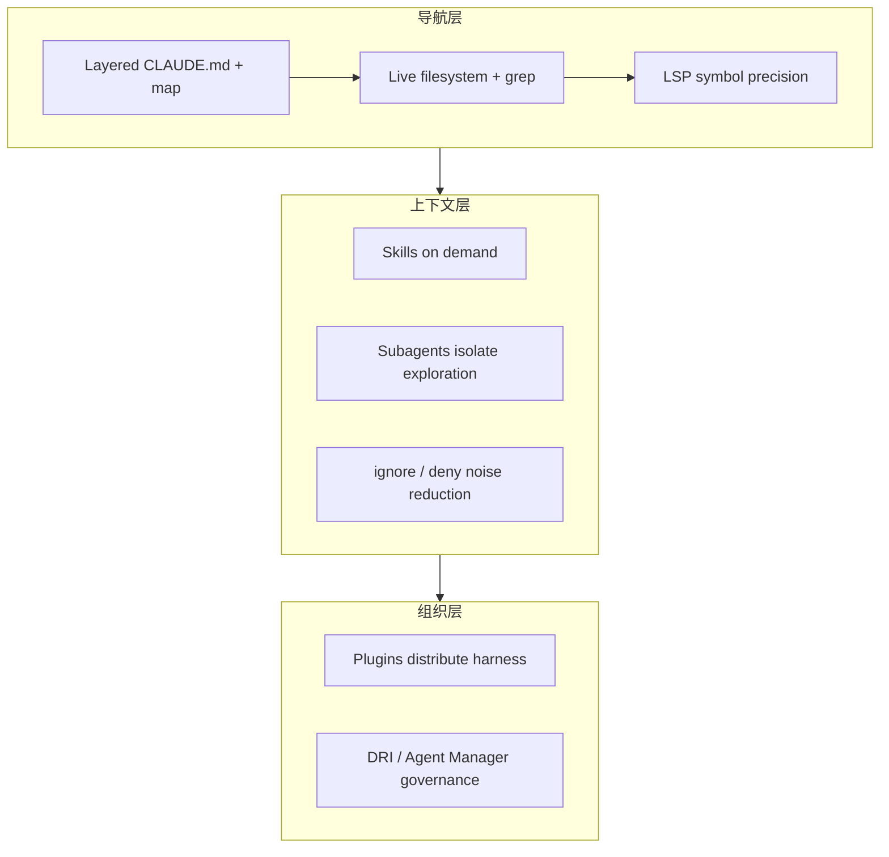
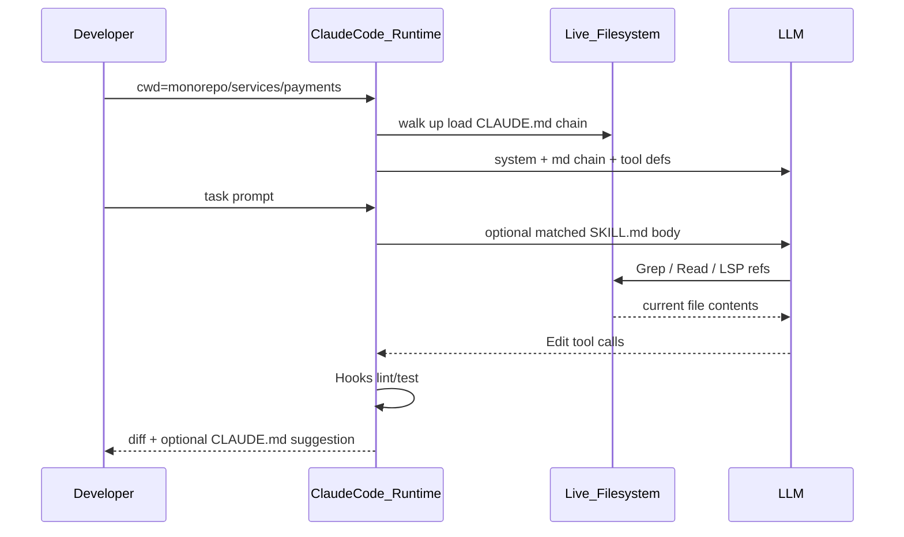

# How Claude Code works in large codebases — 深度分析

- **来源**：https://claude.com/blog/how-claude-code-works-in-large-codebases-best-practices-and-where-to-start
- **发布日期**：2026-05-14
- **厂商**：Anthropic
- **类型**：技术博客（Claude Code at scale 系列开篇）
- **相关产品**：Claude Code、Claude Code for Enterprise、CLAUDE.md / Hooks / Skills / Plugins / MCP / LSP / Subagents、Managed marketplaces

---

## 一句话结论

Anthropic 在大代码库场景押注 **Agentic Search（本地实时读盘 + grep/LSP）而非 RAG 全库索引**；企业级成功更多取决于 **Harness 分层建设顺序**（CLAUDE.md → Hooks → Skills → Plugins → MCP）与 **组织侧 DRI/Agent Manager**，而非单纯换更强模型——对 ToB/进化 POC 的映射是「可导航知识 + 可分发资产 + 治理」，与 Computer Use 文里的 harness 叙事一脉相承。

---

## 发布了什么（事实摘要）

### 1. 系列定位与「大代码库」定义

- **Claude Code at scale** 系列首篇，基于 Applied AI 在多客户（百万行 monorepo、数十年 legacy、跨数十 repo 微服务、数千开发者组织）的部署观察。
- 「大」包含：超大 monorepo、legacy、多 repo 分布式、以及 **C/C++/C#/Java/PHP** 等传统语言栈（文称近期模型在这些场景表现优于多数团队预期）。
- 假设环境：**Git、常规目录结构、工程师为主贡献者**；游戏引擎大 binary、非 Git VCS、非工程师写码需额外配置。

### 2. 导航机制：Agentic Search vs RAG

| 维度 | RAG 类 AI 编码工具 | Claude Code（Agentic） |
|------|-------------------|------------------------|
| 工作方式 | 全库 embedding，查询时检索 chunk | 本地遍历 FS、读文件、grep、跟引用 |
| 大库痛点 | 索引滞后（天/周级），返回已改名/已删符号 | 无中心化索引，每实例面对 **live codebase** |
| 前提 | 索引新鲜度 | 需要 **足够起点上下文** 知道往哪找 |
| 风险 | 陈旧检索 | 模糊模式全库扫会 **先撞 context 上限** |

**结论**：不维护 embedding pipeline；导航质量由 **代码库可 legibility**（CLAUDE.md 分层、skills、ignore）决定。

### 3. Harness 五扩展点 + 两项能力（建设顺序重要）

| 组件 | 加载时机 | 作用 | 常见误区 |
|------|----------|------|----------|
| **CLAUDE.md** | 每 session 自动（向上遍历目录叠加） | 项目/子目录约定与 codebase 知识 | 把应放 skill 的可复用专长全塞进 md |
| **Hooks** | 事件触发 | 确定性 lint/format；**stop hook 反思并提议更新 CLAUDE.md**；start hook 动态加载模块上下文 | 用 prompt 代替应自动化的行为 |
| **Skills** | 按需（progressive disclosure） | 专项工作流；可 **path-scoped**（如仅 payments 目录） | 全塞进 CLAUDE.md 撑爆 context |
| **Plugins** | 配置后常驻可用 | 打包 skills+hooks+MCP，**managed marketplace** 组织分发 | 好配置停留在部落知识 |
| **MCP** | 配置后常驻 | 内网工具/文档/工单/结构化搜索 | 基础未稳就先堆 MCP |
| **LSP**（经 plugin） | 配置后 | 符号级 go-to-def / find-refs，多语言同名消歧 | 以为默认就有 |
| **Subagents** | 调用时 | 独立 context，探索与编辑分离；只回传结果 | 同 session 又探又改 |

**建设顺序建议**：CLAUDE.md → Hooks（含自改进）→ Skills → Plugins → MCP；LSP 对 C/C++ 等多语言大库 **高 ROI**；Subagents 在 harness 就绪后用于「只读探索写文件 → 主 agent 编辑」。

### 4. 三大配置模式（成功部署共性）

**A. 让代码库可导航**

- **CLAUDE.md 精简分层**：root 仅指针与 critical gotchas；子目录 local 约定。
- **在子目录初始化，而非总在 repo root**：Claude 向上 walk 仍会加载沿途 CLAUDE.md，root 上下文不丢。
- **子目录级 test/lint 命令**：避免改一个 service 跑全量 suite 超时并浪费 context（编译型深依赖 monorepo 可能需项目级 build 配置）。
- **`.ignore` + 版本化 `permissions.deny`**：排除生成物/第三方代码；代码生成器团队可本地 override。
- **Codebase map**：根目录 lightweight md 表各 top-level 文件夹一行说明；数百 top-level 时继续分层到子目录 md。
- **LSP**：grep 常见函数名 → 上千匹配；LSP 只返回同 symbol 引用。

**B. 随模型演进维护配置（每 3–6 月或新模型后 plateau 时）**

- 曾为旧模型写的 CLAUDE.md 规则可能 **阻碍** 新模型（如强制单文件 refactor）。
- 为弥补模型/工具缺陷的 hook/skill 在新能力上线后变 **冗余开销**（文例：Perforce `p4 edit` 拦截 hook → 原生 Perforce mode 后删除）。

**C. 组织 ownership**

- 推广最快：**rollout 前** 小团队/单人把 plugins+MCP 接好，首日体验即 productive。
- 职能：DevEx / DevProd；新兴角色 **Agent Manager**（PM+工程混合）；最小可行 **DRI**（配置、权限、marketplace、CLAUDE.md 约定）。
- 无中心化则 bottom-up 热情 **碎片化、plateau**。
- 受监管行业：**批准 skills/plugins 清单、代码评审、有限初始权限**，跨工程/安全/治理 early working group。

### 5. 边界与后续

- 极端 case（数十万文件夹、非 Git VCS）分层 CLAUDE.md 也可能失效 → **系列后续篇**。
- 非传统环境需 Applied AI 定制；企业入口 [Claude Code for Enterprise](https://claude.com/product/claude-code/enterprise)。

---

## 架构与机制拆解

### A. 大代码库 Agent 的两层瓶颈

1. **找得到**（导航）：起点上下文 + LSP + 目录 legibility。
2. **装得下**（context）：lean CLAUDE.md、progressive skills、subagent 分流。
3. **传得开**（组织）：plugin marketplace、审批与评审流程。

### B. Agentic Search 与 RAG 的战略取舍

Anthropic 明确批评大库 RAG 的 **staleness**（重命名/删除无感知）。代价是：

- 每次任务消耗 **更多 agent 步**（读盘、grep）而非一次检索；
- 依赖 **开发者机器本地** 与权限边界（企业合规可能是特性也可能是约束）；
- 全库模糊搜索仍受 **context window** 硬限。

对竞品/自研的启示：若做企业代码 Agent，「实时性」与「索引成本」是产品分叉点，不是纯模型问题。

### C. Harness 分层与「进化」对照

| 机制 | 是否 autonomous 进化 | 含义 |
|------|----------------------|------|
| Stop hook → 提议 CLAUDE.md 更新 | **半自动**：人审后合入 | 会话级经验沉淀为配置资产 |
| Skills / Plugins | 人工编写与 marketplace 分发 | 组织 playbook 编码 |
| 3–6 月配置 review | 人工治理 | 随模型能力 **删减** 过时约束（负向进化） |
| MCP 连内网系统 | 集成扩展 | 非 mem 自学习 |

与 `sf_claw_evolution_poc` 中讨论的 evolution：**此文更接近「可运营配置 + 周期性修剪」**，而非黑盒 mem 改写；hooks 提议 md 更新 ≈ **有治理的 evolution 出口**（应对齐 approve/rollback）。

### D. 与 Computer Use 文的共振

两篇共同论点：**Harness > Model**。

| Computer Use 文 | 本文 |
|-----------------|------|
| 截图 downscale + 坐标 | CLAUDE.md 分层 + ignore |
| cache-aware prune | skills progressive disclosure |
| Teach Mode 演示资产 | Plugins 分发 tribal knowledge |
| PI 分类器 + human-in-the-loop | 批准 plugins/skills + code review |

---

## 核心实现拆解（剧透式）

> Claude Code 本体为 **闭源 CLI/桌面运行时**；下文据官方博客 + [公开文档](https://code.claude.com/docs) 归纳 **运行时行为**（非反编译源码）。与 RAG 编码产品的差异：**没有**「上传/构建 codebase index」这一步。

### 核心模块

| 模块 | 职责 | 关键机制 |
|------|------|----------|
| **上下文加载器** | 每 session 注入项目知识 | 从 **cwd 向上 walk** 合并路径上所有 `CLAUDE.md`；子目录启动也会带上祖先 md |
| **Skill 注册表** | 按需专长，不撑爆每轮 context | 扫描 `skills/**/SKILL.md` 的 YAML frontmatter `description` → 仅匹配任务时 **注入 SKILL 正文**（progressive disclosure） |
| **Hook 运行时** | 确定性副作用 + 配置进化 | `hooks.json` 绑定事件（如 `Stop`/`SessionStart`）→ 执行 shell；stop hook 可 **提议** 改 CLAUDE.md |
| **Plugin 装载器** | 组织级复制最佳实践 | 读 `plugin.json` + 打包的 skills/hooks/`.mcp.json` → 注册到上述子系统；Enterprise **managed marketplace** 分发 |

LSP、Subagents 为 **能力层**：LSP 经 code-intelligence plugin 把 IDE 级 symbol 查询暴露给 agent；Subagents 为 **新 Messages API 会话**，父 agent 只收最终文本。

### 主路径：大库里的「改一个函数」

1. 工程师在 **子目录** `services/payments/` 启动 Claude Code → 加载 `payments/CLAUDE.md` + 父级 `services/CLAUDE.md` + root `CLAUDE.md`（越靠近 cwd 越具体）。
2. 用户描述任务 → 运行时带 **内置 tools**（Read / Grep / Glob / Bash 等），在 **live 工作区** 搜索；**不**先查 embedding 索引。
3. 若 `payments/skills/deploy/SKILL.md` 的 description 命中 → 将 skill 步骤注入当前 turn（path-scoped skill 仅在相关目录生效）。
4. 模型 Read 文件、Grep 符号名；若启用 LSP plugin → **find references** 过滤同名，避免打开上千 grep 命中。
5. 编辑前/后 **Hook** 跑 `npm test`（子目录 CLAUDE.md 里写的命令）；Stop 时 hook 可输出「建议把本次踩坑写入 `CLAUDE.md`」供人 merge。
6. 多子系统探索时可选 **Subagent**：子实例只读扫 repo 写 `findings.md`，父实例 Read 该文件再改代码——探索 token 不挤占编辑 context。

### 与「表面叙事」的差异

| 常见误解 | 实际机制 |
|----------|----------|
| 「Claude Code = 更强的 Copilot 补全」 | 默认是 **agent loop + 工具调用**，补全只是能力子集 |
| 「大库要靠向量索引」 | 官方路线明确 **反对** 滞后 RAG；靠导航配置 + agentic 搜索，代价是步数与 context 管理 |
| 「CLAUDE.md 越大越好」 | 每层 md **每 session 都加载**；专长应下沉到 **Skills**，否则会拖慢/挤占所有任务 |
| 「Plugin = 新模型」 | Plugin 是 **配置与 prompt 资产包**，运行时仍是同一 LLM + MCP |

---

## 对 ToB Agent 的启示

1. **企业代码/运维 Agent 优先考虑「live 数据源」路径**  
   物流、工单、配置中心若用「昨晚的索引」会犯与 RAG 代码库相同的 stale 错误；Agentic 读 API/DB/实时 grep 日志更贴 Anthropic 路线，但需设计 **起点上下文**（哪条链路、哪个服务）。

2. **资产分层：全局 md / 路径 skill / 组织 plugin**  
   顺丰类多系统 POC：root 只放架构指针；WMS/TMS 子目录放本域 lint/测试/术语；跨团队用 plugin 统一分发，避免每人一份 prompt。

3. **Hooks 做确定性，Skills 做专长，别把一切都写进 system prompt**  
   对齐进化框架：P0 规则用 hook 强制执行；领域 SOP 用 skill；mem 进化若做，不应替代 hook 的确定性边界。

4. **LSP/结构化查询 ≈ 大库里的「符号导航」**  
   非代码场景对标：schema-aware 查询、链路 trace ID、主数据 ID 解析——减少「全文 grep 业务日志」烧 context。

5. **组织 DRI 是 adoption 的乘数**  
   技术栈就绪 < 首日体验；最小投入：1 名 Agent Manager/DRI + 批准清单 + 3–6 月配置审计节奏。

6. **模型升级时要敢删配置**  
   ToB 常见债务：为旧模型写的冗长约束阻碍新模型；进化系统需 **「退役规则」** 与版本化配置，而非只增不减。

7. **受监管行业：先窄后宽**  
   与法务/金融部署文一致——approved skills、评审门禁、跨职能 working group，再扩权限。

---

## 与当前工作的关联

| 本项目/文档 | 关联点 |
|-------------|--------|
| `projects/sf_claw_evolution_poc` | 进化产物应对齐 **CLAUDE.md/Skills/Plugins 分层**；hook 提议更新 ≈ 进化候选需审批入库 |
| `framework/evolution_onepager.md` | Anthropic 侧「进化」= 配置资产迭代 + 模型代际后 **修剪**，非 autonomous mem |
| `research/tech_selection_for_sf_poc.md` | 若对比 Cursor/Claude Code/自建 Agent：索引 vs agentic 是架构分叉 |
| `frontier_vendors/anthropic/deep_dives/2026-05-13_computer-browser-use-best-practices.md` | 同属 harness-first 企业 Agent 方法论 |
| `frontier_vendors/anthropic/deep_dives/2026-05-12_claude-for-legal-industry.md` | 法务：MCP+插件生态；本文：工程侧 MCP+plugin marketplace——企业双翼 |
| 本仓库 `AGENTS.md` / `.cursor/rules` | 可直接映射为「分层 CLAUDE.md + path-scoped rules + 精简 root」实践 |

---

## 待跟踪信号

- [ ] **Claude Code at scale** 系列后续：超大规模文件夹、非 Git VCS 的专项方案
- [ ] Managed marketplace 与 Enterprise 的权限/审计 API 是否公开
- [ ] Stop hook 自动提议 CLAUDE.md 更新的默认模板与合入工作流
- [ ] LSP code intelligence plugin 对各语言覆盖矩阵与 monorepo 性能
- [ ] Agent Manager 职能是否在客户案例中有 JD/编制参考
- [ ] Anthropic 是否发布 Agentic vs RAG 的量化 benchmark（大库检索准确率/新鲜度）
- [ ] 与 Cursor 的 codebase indexing 策略差异是否会在后续博文正面回应

---

## 参考链接

- 原文：https://claude.com/blog/how-claude-code-works-in-large-codebases-best-practices-and-where-to-start
- Claude Code Enterprise：https://claude.com/product/claude-code/enterprise
- CLAUDE.md / memory：https://code.claude.com/docs/en/memory
- Hooks：https://code.claude.com/docs/en/hooks-guide
- Skills：https://code.claude.com/docs/en/skills
- Agent Skills best practices：https://platform.claude.com/docs/en/agents-and-tools/agent-skills/best-practices
- Plugins：https://code.claude.com/docs/en/plugins
- Managed marketplaces：https://support.claude.com/en/articles/13837433-manage-claude-cowork-plugins-for-your-organization
- Subagents：https://code.claude.com/docs/en/sub-agents
- Code intelligence plugins：https://code.claude.com/docs/en/discover-plugins#code-intelligence
