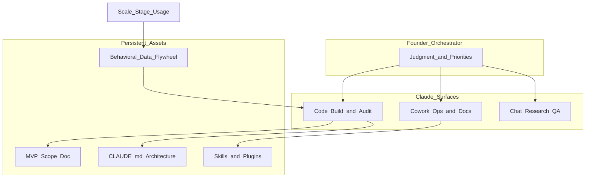

# The founder's playbook: Building an AI-native startup — 深度分析

> **站点阅读版（合并本次与既往调研）**：[2026-05-14_the-founders-playbook.html](2026-05-14_the-founders-playbook.html)

- **来源**：https://claude.com/blog/the-founders-playbook
- **完整 Playbook（PDF）**：https://cdn.prod.website-files.com/6889473510b50328dbb70ae6/69fe2a55b93bb0732b1fe33c_The-Founders-Playbook-05062026_v3%20(1).pdf
- **解读更新**：2026-05-25（首页排序用；官方发布 2026-05-14）
- **厂商**：Anthropic
- **类型**：方法论 / GTM（创业全生命周期 × Claude 产品矩阵）
- **相关产品**：Claude Chat、Claude Cowork、Claude Code、Claude Platform、Startups Program

---

## 一句话结论

Anthropic 用 **Idea → MVP → Launch → Scale** 四阶段重画创业路径，核心主张是：创始人从 IC 变为 **Agent 编排者**；产品分工为 **Chat（快问）/ Cowork（知识工作+连接器）/ Code（工程）**；真正瓶颈不再是「能不能造出来」，而是 **验证纪律、架构上下文（CLAUDE.md）、PMF 度量与治理**——对 ToB/FDE 的启示是「进化」应落在 **可审计资产 + 运营系统**，而非单纯让模型自改。

---

## 发布了什么（事实摘要）

### 1. 博客 vs 电子书

- 博客文（约 5 分钟阅读）是 **引流页**，正文在约 35 页 PDF《The Founder's Playbook: Building an AI-Native Startup》。
- 目标读者：从 Day 0 就要按 AI-native 架构创业的创始人，以及早期运营同学。

### 2. 核心叙事

| 论点 | 内容 |
|------|------|
| 生命周期被「重启」 | 传统路径 validate→raise→hire→build 被压缩；AI 抹平资本/人头/技能门槛 |
| 创始人角色 | 从「会写代码/会做生意」→ **编排 agents**，注意力上移到「做什么、为什么」 |
| 失败主因仍不变 | 引用 **42% 初创因「做了没人要的东西」失败**；Agentic coding 让「误把原型当验证」更危险 |
| 三能力支柱 | 研究（Chat/Cowork）、Agentic coding（Code）、工作流自动化（Cowork + MCP） |

### 3. 四阶段框架（每阶段：目标 / 退出标准 / 典型失败 / Claude 用法）

#### Idea（验证问题，再写代码）

- **目标**：问题-方案契合（problem-solution fit），用研究与客户对话攒证据。
- **退出标准**（三问皆 Yes）：问题真实且具体；方案对准**验证后**的问题；有足够信号支撑做 MVP。
- **典型失败**：
  - **把建造当验证**（有原型≠有 PMF）
  - **过早扩张执行**（AI 对错误前提同样热情）
  - **确认偏误**（用 AI 只找支持性证据）
- **Claude 用法**：竞品/Devil's advocate、TAM/SAM、客户访谈设计与笔记综合、Cowork 做外联与排期；**末段才**用 Code 做轻量原型给真实用户摸。
- **产品矩阵**：Chat=快问；Cowork=多源研究/成品文档/定时任务；Code=尚非主战场。

#### MVP（验证方案，控制技术债）

- **目标**：最小可用产品 + **真实使用证据**；同时避免 Agentic 技术债。
- **退出标准**：PMF 证据（留存/付费/推荐）；非单次 launch 热度。
- **典型失败**：
  - **Agentic technical debt**（无 CLAUDE.md/架构约束，每 session 重推结构）
  - **假 PMF**（朋友/PH  spike ≠ week 6–12）
  - **零摩擦 scope creep**（加功能成本趋零）
  - **安全 inexperience**（能跑≠安全）
- **关键实践**：
  - 开工前用 Chat 写 **架构原则** → 落盘 **`CLAUDE.md`**（项目级持久上下文）
  - **Scope 文档**：做什么、刻意不做什么、加功能需用户证据
  - Code 每 session：读 scope + CLAUDE.md，结束写 session log
  - 上线前安全审查（Code Security 有限 beta）
  - **上线前定指标**：留存、激活、假阳性模式；Sean Ellis「非常失望」>40% 等
- **产品矩阵**：Code 为主力建造；Cowork 管反馈运营；Chat 做对抗性解读数据。

#### Launch（把牵引变成可重复增长）

- **目标**：可重复获客、生产级可靠、**运营不绑在创始人身上**。
- **退出标准**：渠道化增长（CAC/LTV）；扛生产负载；流程与自动化替代创始人手工。
- **典型失败**：MVP 技术债到期；创始人成瓶颈；安全/合规不可再拖；过早扩市场稀释 PMF。
- **Claude 用法**：Code 架构审计与还债；Cowork 运营审计→自动化工作流；合规向 Code 扫描 + Chat 排优先级；Cowork 跑 sprint/bug/周报。
- **产品矩阵**：三件套 **compound**——Code 做产品，Cowork 做公司运营，Chat 沉淀可复用知识。

#### Scale（系统化增长与护城河）

- **目标**：千万级用户/多市场；**领域深度 + 集成 + 数据飞轮** 构成 moat。
- **退出标准**：可持续盈利 / IPO-ready / 被收购；增长可审计；组织可脱离创始人日操。
- **主题**：Cowork 接管日操；Code 做企业级集成/API；Chat 把创始人领域知识外化为 Skills/记忆；workflow lock-in。
- **案例方向**（Resources）：HumanLayer、Ambral、Carta Healthcare、Anything、Duvo、Wordsmith 等。

### 4. 产品矩阵（全文反复强调）

| 任务类型 | 用谁 | 原因 |
|----------|------|------|
| 问答、改写、头脑风暴 | **Chat** | 快、对话、零 setup |
| 多文件研究、连接器、定时产出 | **Cowork** | 文件夹、MCP、Skills、scheduled runs |
| 写/测/发软件 | **Code** | 代码库、git、Plan Mode、环境 |

三者共享同一 Claude 模型，差异在 **工作区与工具边界**。

### 5. 与「进化」相关的隐含设计

Playbook **不宣传** Hermes 式 autonomous self-evolution，而是：

- **CLAUDE.md + Scope 文档** = 人工治理的「记忆/规则」
- **Skills（Cowork）** = 可复用工作流资产
- **用户行为数据飞轮**（Scale 章）= 产品层 compounding，需 deliberate 设计反馈环
- **创始人审批**仍贯穿 Launch/Scale 的合规与安全

---

## 架构与机制拆解

**机制要点：**

1. **阶段门控**：每阶段有 exit criteria，防止「能建就建」。
2. **上下文工程**：`CLAUDE.md` 被定位为 MVP 的「第一项交付物」，等同你们说的 **memory/playbook 工程化**。
3. **对抗性研究**：Devil's advocate、disconfirming evidence 贯穿 Idea–Scale。
4. **运营 Agent 化**：Launch 起 Cowork 用 MCP 替代创始人重复劳动（外联、排期、周报、工单路由）。

---

## 对 ToB Agent 的启示

1. **客户不是「缺模型」而是缺阶段方法论**  
   可把 Playbook 四阶段映射到企业 AI 落地：PoC（Idea）→ 试点 MVP → 部门 Launch → 集团 Scale。

2. **产品矩阵可照抄做售前**  
   - 业务用户 → Chat/Cowork  
   - 集成与流程 → Cowork + MCP  
   - 工程与平台 → Code / Agent SDK  

3. **「进化」在 Anthropic 叙事里 = 资产累积，不是黑盒自改**  
   与法务插件、常见的 **notify/approve/rollback** 一致：**先 playbook + 连接器，再谈 skill/mem 自动晋升**。

4. **假 PMF / 假进化 同源**  
   早期指标好看 ≠ 能力真的提升；企业侧需要 **静态 benchmark + 回归 + 人工审批**。

5. **合规 caveat（第三方报道）**  
   有评论指出：Playbook 推荐 Cowork 做合规流，但 Anthropic 文档称 Cowork 活动可能 **不进审计日志**，SOC2/HIPAA 等场景需谨慎——ToB 交付时要 **区分 Chat/Cowork/Code 的合规边界**。

---

## 待跟踪信号

- [ ] Startups Program 与 Enterprise 产品在四阶段上的打包是否统一
- [ ] Claude Code Security GA 时间与能力边界
- [ ] Cowork 审计日志能力是否更新（影响合规话术）
- [ ] Playbook 是否发布非 PDF 的可检索版本（便于引用具体 exercise）
- [ ] 国内 ToB 客户对「创始人编排者」叙事的接受度 vs「要开箱自动化」预期

---

## 参考链接

- 博客：https://claude.com/blog/the-founders-playbook
- PDF：https://cdn.prod.website-files.com/6889473510b50328dbb70ae6/69fe2a55b93bb0732b1fe33c_The-Founders-Playbook-05062026_v3%20(1).pdf
- Startups：https://claude.com/programs/startups
- CLAUDE.md 文档（Code）：https://code.claude.com/docs（Playbook Resources 指向）
- 相关案例博客：HumanLayer / Ambral / Carta Healthcare 等见 PDF Resources 章
